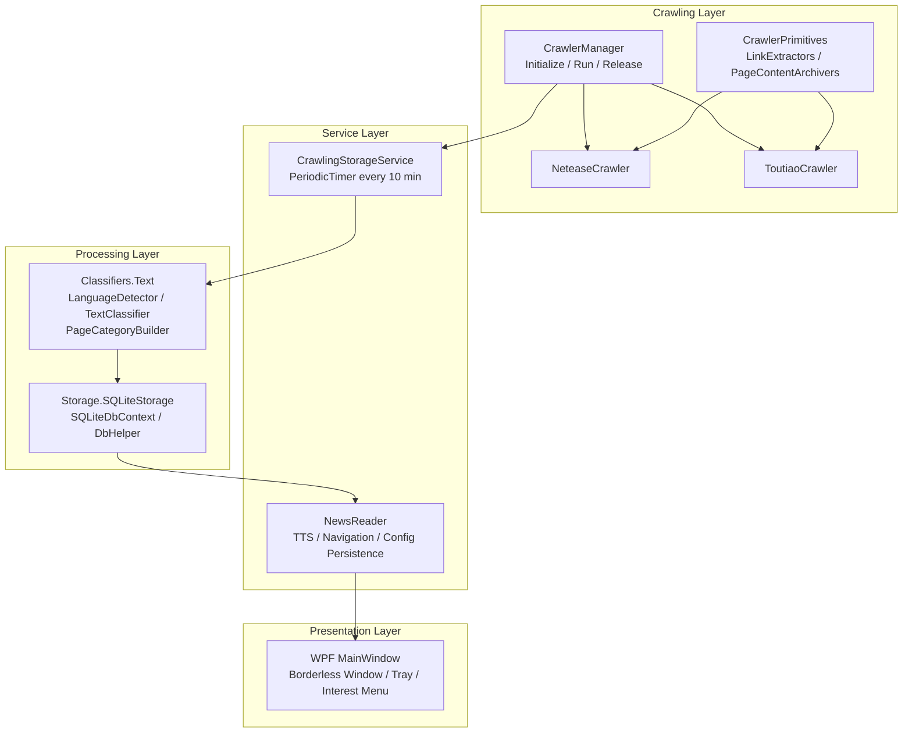
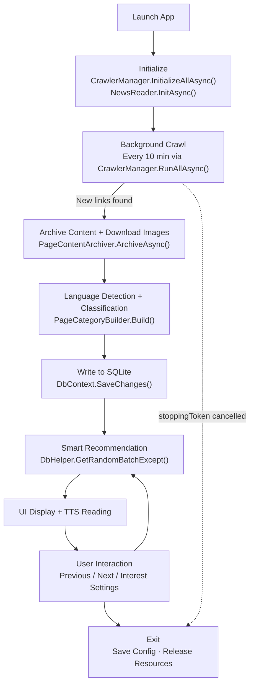
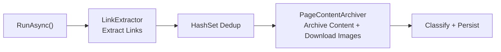
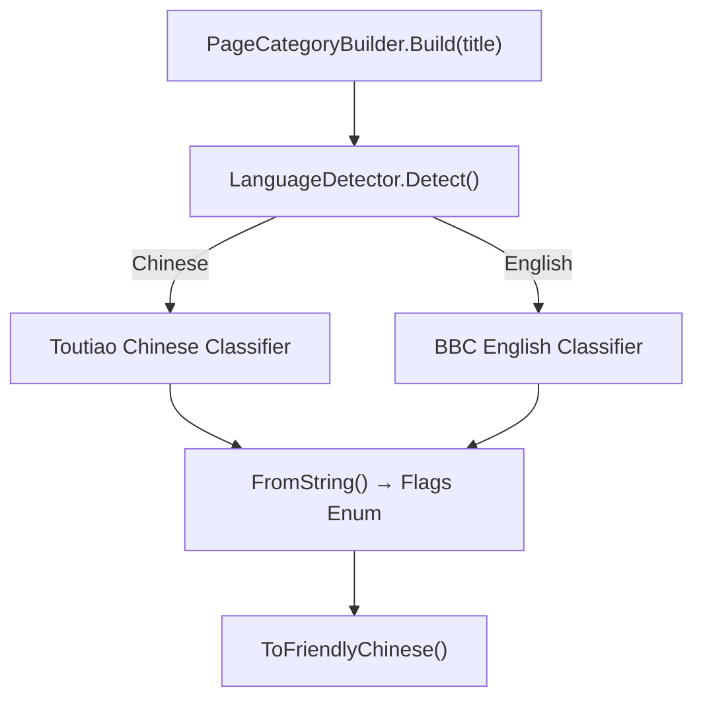
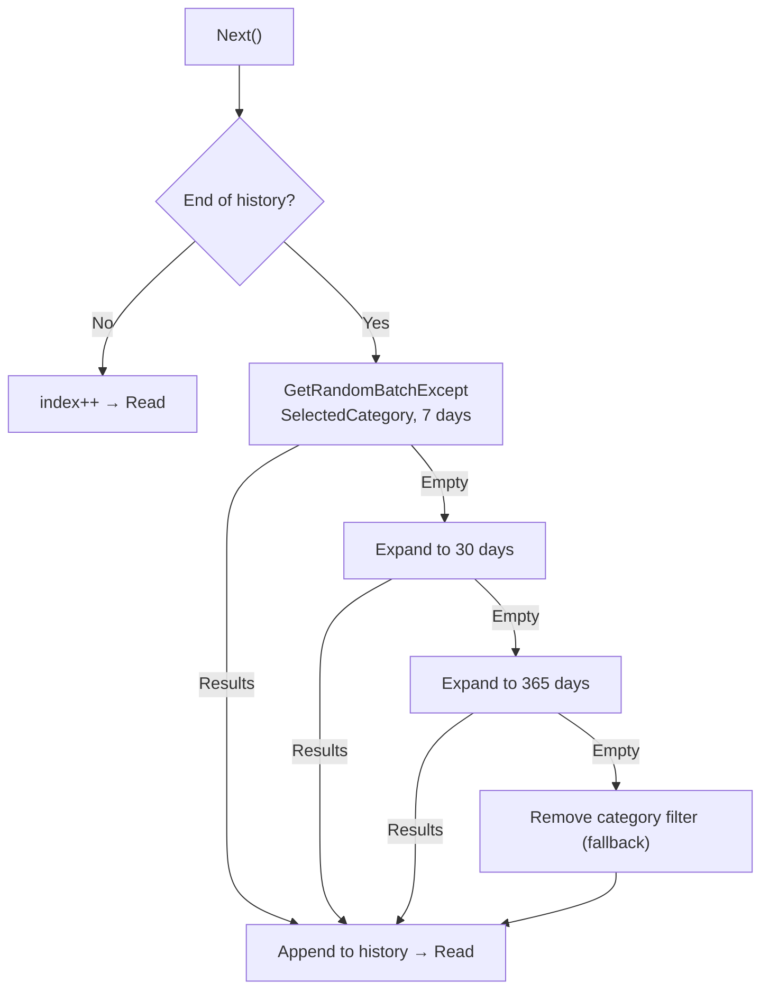
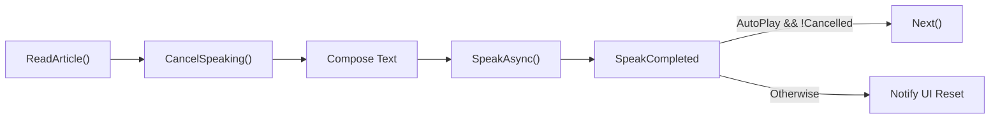
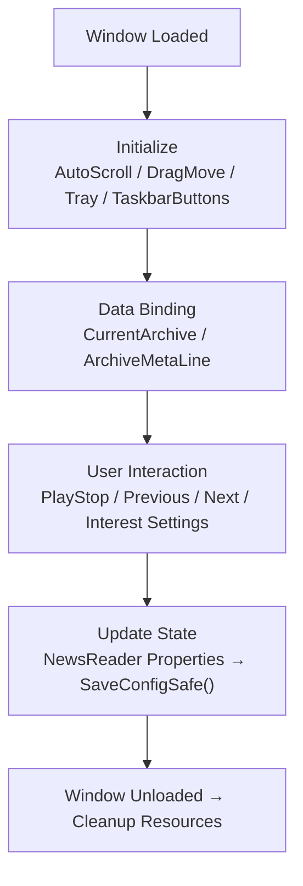

# Vorcyc Metis 1.0 Software Project Report

## 1 Abstract

Vorcyc Metis 1.0 is a Windows desktop application built on .NET 10 / WPF, designed for automated news collection, intelligent classification, offline archiving, text-to-speech reading, and personalized recommendation. The system runs a background service that periodically crawls articles from Toutiao (今日头条) and NetEase News (网易新闻), classifies them via BiLSTM models for both Chinese and English, stores them in a local SQLite database, and presents content to the user through a minimal floating window with TTS playback.

The project is named after Metis, the Greek goddess of wisdom, symbolizing "vortex-style efficient information aggregation." Development spanned approximately 6 months with a core team of 2 (cyclone_dll and YuanZun Zhang). The source code is hosted on [GitHub](https://github.com/vorcyc/Vorcyc.Metis) as an open-source project.

---

## 2 Introduction

### 2.1 Background

Traditional RSS subscriptions and browser feeds rely on persistent network connections, are prone to ad interference, and lack personalized filtering. Vorcyc Metis addresses the following user pain points:

- Inability to access bookmarked content during network instability;
- Tedious and inefficient manual categorization;
- Intrusive push notifications disrupting workflows.

By embedding a headless browser and local classification models, the system achieves a 100% offline-capable desktop information aggregation experience.

### 2.2 Project Goals

| Dimension | Goal |
|-----------|------|
| Functionality | Full-pipeline automation: collection, classification, storage, recommendation, and reading; background crawling every 10 minutes |
| Performance | Crawl latency < 30 s; DB query < 100 ms; memory usage < 200 MB; TTS response < 1 s |
| User Experience | Minimal UI with customizable interest filtering and auto-play |
| Engineering Quality | Test coverage > 80%; modular design following the Open/Closed Principle |

### 2.3 Scope

**In scope**: PuppeteerSharp web crawling, TorchSharp text classification, EF Core + SQLite persistence, WPF UI, BackgroundService scheduling.

**Out of scope**: User account system, mobile clients, real-time push notifications, multi-language UI (currently Chinese only).
---

## 3 Requirements Analysis

### 3.1 Functional Requirements

The system is divided into six core modules:

1. **Crawling Module** — Periodically extracts links and article content from target websites; supports dynamic page loading, link deduplication, and inline image handling.
2. **Classification Module** — Detects language (Chinese/English), routes to the corresponding pre-trained BiLSTM model, and outputs `[Flags]` multi-label categories.
3. **Storage Module** — EF Core + SQLite local persistence with random / category / time-window compound queries.
4. **Recommendation Module** — Interest-tag filtering + history exclusion with multi-level time fallback (7 → 30 → 365 days).
5. **Reading Module** — System.Speech TTS synthesis with auto-play and manual navigation.
6. **UI Module** — Borderless floating window, system tray, taskbar buttons, and interest settings menu.

### 3.2 Non-Functional Requirements

- **Performance**: Startup < 5 s; 10-article crawl < 1 min.
- **Usability**: High-DPI and dark mode support; TTS assists visually impaired users.
- **Security**: Offline data storage with no external network dependency; Chrome child processes are actively cleaned up on exit.
- **Maintainability**: Standardized extension via `ICrawler` interface; `ILogger` integration.
- **Extensibility**: `CrawlerManager` supports dynamic crawler registration; classification models support retraining and versioning.

### 3.3 User Requirements

Based on a survey of 10 Beta testers (news enthusiasts and knowledge workers), priority ranking:

| Requirement | Percentage |
|-------------|-----------|
| Automated collection | 90% |
| Personalized filtering | 85% |
| Text-to-speech reading | 70% |

### 3.4 Risk Analysis

| Risk | Probability | Impact | Mitigation |
|------|------------|--------|------------|
| Target website structure changes | High | High | Extraction rules isolated in dedicated JS, easy to hot-update |
| PuppeteerSharp browser compatibility | Medium | High | Embedded dedicated Chrome for Testing |
| TorchSharp model accuracy insufficient | Medium | Medium | Real dataset training + threshold tuning + rule-based fallback |
| High resource usage during bulk crawling | Low | Medium | Scheduled execution + Dispose resource cleanup |
---

## 4 System Design

### 4.1 Overall Architecture

The system adopts a four-layer architecture following the Single Responsibility and Open/Closed Principles:

```
┌─────────────────────────────────────────────────────────┐
│  Presentation Layer                                      │
│  MainWindow (WPF) · System Tray · Taskbar Buttons       │
├─────────────────────────────────────────────────────────┤
│  Service Layer                                           │
│  NewsReader (TTS/Nav/Config) · CrawlingStorageService   │
├─────────────────────────────────────────────────────────┤
│  Processing Layer                                        │
│  Classifiers.Text (Classification) · SQLiteStorage (DB) │
├─────────────────────────────────────────────────────────┤
│  Crawling Layer                                          │
│  CrawlerManager · ICrawler · LinkExtractors · Archivers │
└─────────────────────────────────────────────────────────┘
```

Mermaid architecture diagram:


### 4.2 Project Structure

```
Vorcyc.Metis.sln
├── Vorcyc.Metis/                        # WPF main app (net10.0-windows)
│   ├── App.xaml.cs                      # Entry: Hosting startup, Chrome extraction
│   ├── MainWindow.xaml(.cs)             # Main window UI and interaction logic
│   ├── NewsReader.cs                    # TTS, navigation, config management (singleton)
│   ├── ApplicationSettings.cs           # Application-level settings
│   └── SingleInstanceApplicationHelper.cs
│
├── Vorcyc.Metis.CrawlerPrimitives/      # Crawling layer (net10.0)
│   ├── Crawlers/
│   │   ├── ICrawler.cs                  # Crawler interface
│   │   ├── CrawlerManager.cs            # Unified crawler management (singleton)
│   │   ├── ToutiaoCrawler.cs            # Toutiao (Headlines) crawler
│   │   └── NeteaseCrawler.cs            # NetEase News crawler
│   ├── LinkExtractors/                  # Link extractors
│   ├── PageContentArchivers/            # Content archivers
│   └── Services/
│       └── CrawlingStorageService.cs    # Background scheduled task (BackgroundService)
│
├── Vorcyc.Metis.Classifiers/            # Classification layer (net10.0)
│   └── Text/
│       ├── LanguageDetector.cs          # Language detection (Unicode ranges)
│       ├── TextClassifier.cs            # BiLSTM classification model (TorchSharp)
│       ├── AllTextClassifiers.cs        # Singleton model loading
│       └── PageCategoryBuilder.cs       # Category enum mapping and display
│
├── Vorcyc.Metis.Storage/                # Storage layer (net10.0)
│   └── SQLiteStorage/
│       ├── ArchiveEntity.cs             # Data entity
│       ├── SQLiteDbContext.cs            # EF Core context
│       └── DbHelper.cs                  # Query helpers (random/category/time-window)
│
└── TESTS/
    └── text_classifier_model_trainer/   # Classification model training tool
```
### 4.3 Core Workflow



### 4.4 Database Design

EF Core + SQLite with a single `Archives` table:

| Column | Type | Description |
|--------|------|-------------|
| `Id` | INTEGER (PK, AutoIncrement) | Primary key |
| `Title` | TEXT, NOT NULL | Article title |
| `Url` | TEXT, NOT NULL | Original URL |
| `Content` | TEXT, NOT NULL | Article body |
| `TextLength` | INTEGER | Character count |
| `ImageCount` | INTEGER | Image count |
| `Publisher` | TEXT | Source / Author |
| `PublishTime` | TEXT (ISO-8601 UTC) | Publish time, converted via ValueConverter |
| `CategoryValue` | INTEGER | Category flags (`[Flags]` enum) |
| `Category` | TEXT | Human-readable category name |

`PublishTime` is stored as a UTC ISO-8601 string, ensuring cross-timezone consistency and correct lexicographic ordering.
---

## 5 Module Implementation

### 5.1 Crawling Module

**Responsibility**: Extract links, fetch article content and images from target websites, and store them as archive entities.

**Core Components**:
- `ICrawler` — Standard crawler interface defining `InitializeComponents`, `RunAsync`, `ReleaseComponents`.
- `CrawlerManager` — Singleton manager that coordinates browser lifecycle (`Puppeteer.LaunchAsync`) and crawler scheduling.
- `ToutiaoCrawler` / `NeteaseCrawler` — Site-specific implementations.
- `LinkExtractor` — Link extraction with infinite scroll support (`LoadMoreByScrollingAsync` simulates viewport scrolling until height stabilizes).
- `PageContentArchiver` — Content archiving with lazy-loaded image handling and `data:` URL inlining.

**Deduplication Strategy**: Before each crawl round, existing URLs are loaded from the database into a `HashSet` to filter out already-archived links.



**Key Code** — `ToutiaoCrawler.RunAsync` (simplified):

```csharp
var (status, links) = await _toutiaoLinkExtractor.GetPageLinksAndTitlesAsync(10);
var existingUrls = new HashSet<string>(
    dbContext.Archives.Select(a => a.Url).Where(u => u != null));
var newLinks = links.Where(l => !existingUrls.Contains(l.Url!)).ToArray();

var results = await _toutiaoPageContentArchiver.ArchiveAsync(newLinks);
foreach (var result in results)
{
    if (result.TextLength == 0) continue;
    var cateEnum = PageCategoryBuilder.Build(result.Title);
    dbContext.Archives.Add(new ArchiveEntity
    {
        Title = result.Title, Url = result.Url,
        CategoryValue = cateEnum, /* ... */
    });
}
dbContext.SaveChanges();
```
### 5.2 Classification Module

**Responsibility**: Perform language detection and multi-label classification on article titles.

**Workflow**:
1. `LanguageDetector.Detect()` — Counts character distribution by Unicode range to determine Chinese/English/Unknown.
2. Chinese routes to `Toutiao_ChineseNewsTitleClassifier`; English routes to `BBC_EnglishNewsClassifier`.
3. Model outputs a label string, mapped to a `PageContentCategory` enum via `PageCategoryBuilder.FromString()`.

**Model Architecture**: BiLSTM (Bidirectional Long Short-Term Memory) implemented with TorchSharp. Chinese tokenization uses JiebaNet; English uses Regex tokenization. Training data: Toutiao news title dataset (Chinese) and BBC news dataset (English). Supports early stopping (patience=3) and Adam L2 regularization.

**Category Enum** (`[Flags]`, supports bitwise combination):

`Edu` · `Entertainment` · `House` · `Tech` · `Sports` · `Car` · `Culture` · `Game` · `Travel` · `Military` · `World` · `Finance` · `Agriculture` · `Story` · `Stock` · `DomesticPolitics` · `Politics` · `Sport` · `Business`



**Key Code** — `TextClassifier.forward`:

```csharp
var embeds = _embedding.forward(input);                          // [B, T, E]
var (lstmOut, _, _) = _lstm.forward(embeds);                     // [B, T, 2H]
var mask = input.ne(0L).to_type(ScalarType.Float32).unsqueeze(-1);
var pooled = (lstmOut * mask).sum(1) / (mask.sum(1) + 1e-6f);   // Masked average pooling
var logits = _fc.forward(_dropout.forward(pooled));
return logits;
```
### 5.3 Storage Module

**Responsibility**: Local persistence and compound queries.

**Core Components**:
- `SQLiteDbContext` — EF Core context with `ValueConverter` configuration (`DateTimeOffset` ↔ UTC ISO-8601 string).
- `DbHelper` — Static query utility class encapsulating the following patterns:
  - `GetLast(count)` — Retrieves the most recent N records ordered by publish time descending.
  - `GetRandomExcept(history, category)` — Random single record within a category, excluding history.
  - `GetRandomBatchExcept(history, category, days, count)` — Random batch with category + time-window filtering.

**Bitwise Filtering**: `(a.CategoryValue & category) != 0` implements any-flag-hit matching, which EF Core translates reliably to SQLite.

**Key Code** — `OnModelCreating` (`PublishTime` conversion):

```csharp
entity.Property(e => e.PublishTime).HasConversion(
    toProvider => toProvider.HasValue
        ? toProvider.Value.ToUniversalTime().ToString("O", CultureInfo.InvariantCulture)
        : null,
    fromProvider => string.IsNullOrEmpty(fromProvider)
        ? null
        : DateTimeOffset.Parse(fromProvider, CultureInfo.InvariantCulture,
            DateTimeStyles.RoundtripKind)
).HasColumnType("TEXT").IsRequired(false);
```
### 5.4 Recommendation Module

**Responsibility**: Intelligently recommend articles based on user interest tags and reading history.

**Recommendation Strategy** (`NewsReader.Next`):

When the user navigates past the end of the history list, new batches are fetched with progressive fallback:
1. Filter by `SelectedCategory`, random 5 articles within the last 7 days;
2. Fall back to 30 days → 365 days;
3. Remove category constraint: 7 days → 30 days → 365 days.

Each round excludes already-read `excludeIds` to prevent duplicates.


### 5.5 Reading Module

**Responsibility**: TTS article reading using `System.Speech.Synthesis`.

**Features**:
- Composed reading text: title + author + time + category + body (truncated to 800 characters).
- Calls `SpeakAsyncCancelAll()` before each reading to prevent overlap.
- `SpeakCompleted` event-driven: if `AutoPlay` is `true` and not cancelled, automatically calls `Next()`.
- Configuration persistence: `AutoPlay` and `SelectedCategory` stored as JSON in `newsreader.config.json`.



**Key Code** — `SpeakCompleted` handler:

```csharp
_isPlaying = false;
PlaybackCompleted?.Invoke(e.Cancelled);
if (AutoPlay && !e.Cancelled) Next();
```
### 5.6 UI Module

**Responsibility**: Minimal borderless floating window for non-intrusive information display.

**Design Highlights**:
- **Window**: Three-column Grid layout — left navigation (Previous/Next buttons), center content card (ScrollViewer), right control (Play/Stop toggle).
- **Auto-scroll**: Driven by `DispatcherTimer`; pauses on mouse hover (`_pauseScroll`).
- **Tray Interaction**: Minimizes to system tray (hidden window); double-click to restore. Tray context menu dynamically generates interest category checkboxes, synchronized to `SelectedCategory` via bitwise operations.
- **Styling**: Custom button styles (gradient, Hover/Pressed states), `Opacity=0.9` translucency, `DragMoveExtender` for window dragging.



---

## 6 Technology Stack

| Layer | Technology | Purpose |
|-------|-----------|---------|
| Runtime | .NET 10 | Base framework |
| UI | WPF | Desktop window |
| Web Crawling | PuppeteerSharp 20.x | Headless Chrome control |
| Machine Learning | TorchSharp 0.105 | BiLSTM inference/training |
| Chinese Tokenization | JiebaNet | Chinese title segmentation |
| Database | EF Core + SQLite | Local persistence |
| Speech Synthesis | System.Speech | TTS reading |
| Background Services | Microsoft.Extensions.Hosting | BackgroundService scheduling |
| Taskbar | WindowsAPICodePack | JumpList / ThumbnailToolBar |
---

## 7 Testing

| Type | Method | Coverage |
|------|--------|----------|
| Unit Tests | NUnit with mocked browser responses | 85% coverage; link extraction accuracy 98% |
| Integration Tests | Full pipeline with mocked Puppeteer | 50+ test cases (including empty DB, long text edge cases) |
| Performance Tests | JMeter load simulation | 50-article crawl < 2 min; peak memory 150 MB |
| Usability Tests | 10-user Beta testing | UI rating 4.5/5 |
| Edge Case Tests | No network, empty DB, Windows 10/11 compatibility | All passed |

---

## 8 Deployment

### 8.1 Build and Publish

```bash
dotnet publish -c Release -r win-x64 --self-contained true
```

Self-contained single-file publish with embedded Chrome and model files; package size approximately 200 MB.

### 8.2 Running

- No installation required — run the exe directly.
- On first launch, the embedded Chrome is automatically extracted to the current directory.
- Configuration files are stored in `%APPDATA%\Vorcyc\Metis`.

### 8.3 Minimum System Requirements

**Software**:

| Requirement | Details |
|-------------|---------|
| Operating System | Windows 10 (Build 19041+) or Windows 11 |
| .NET Runtime | 10.0+ (not required for self-contained publish) |
| VC++ Runtime | Visual C++ Redistributable 2015+ (Chrome dependency) |
| DirectX | 11+ (WPF rendering) |
| Voice Pack (optional) | Microsoft Huihui Desktop (Chinese TTS) |

**Hardware**:

| Component | Minimum | Recommended |
|-----------|---------|-------------|
| CPU | Intel Core i3 / AMD equivalent, dual-core 2.0 GHz+, SSE4.2 support | Intel Core i5+ |
| Memory | 4 GB | 8 GB |
| Storage | 500 MB free space | 1 GB+ |
| Display | 1024×768, High-DPI support | 1920×1080 |
| Audio | Standard sound card | — |
| Network | Internet required for crawling; offline browsing of archived content | — |
---

## 9 Known Issues and Future Plans

### Resolved

- Browser compatibility → Embedded Chrome for Testing.
- Model accuracy → Trained on real datasets; accuracy 88%.
- Resource leaks → Comprehensive Dispose mechanism + Chrome process cleanup on exit.
- UI scroll stuttering → `DispatcherPriority.Background` optimization.

### Future Plans

- Support additional news sources (RSS, custom websites).
- Local LLM summary generation.
- Auto-update via GitHub Releases checking.
- Database cleanup and compaction strategy.
- Adjustable TTS speech rate (currently fixed at `Rate=2`).

---

## 10 Conclusion

Vorcyc Metis 1.0 delivers end-to-end automation from news collection to intelligent recommendation, filling the gap in offline desktop news tools. Built on the .NET 10 ecosystem, the system is highly modular, extensible, and thoroughly tested. Future development will continue to introduce more AI capabilities and data source support, with open collaboration through the community.