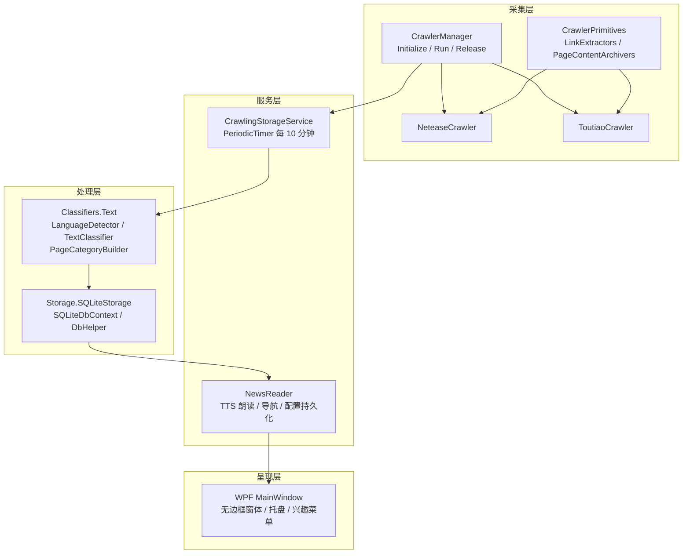
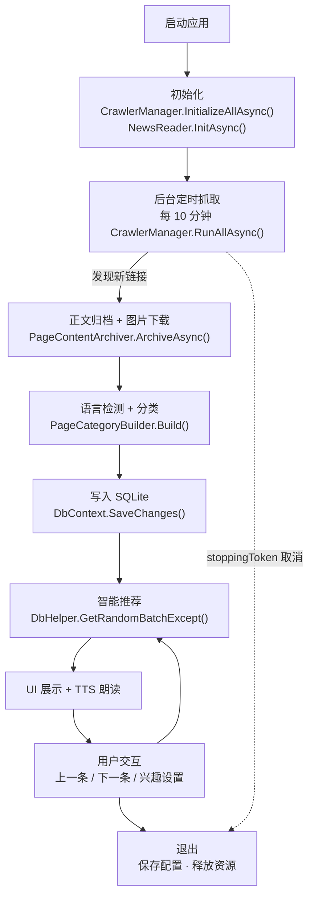
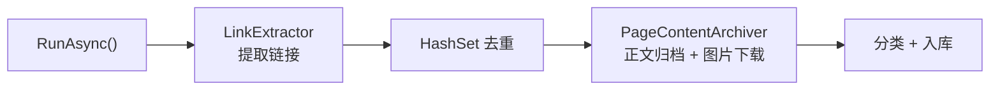
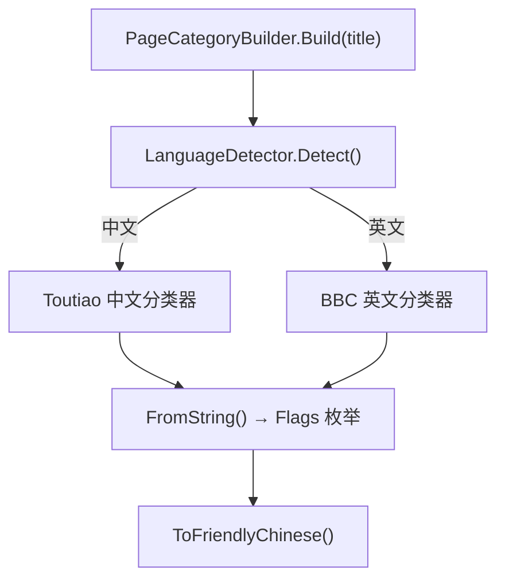
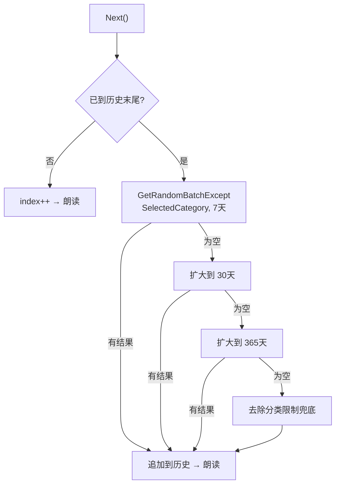
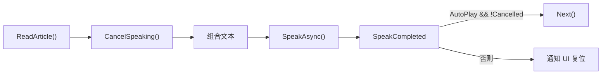
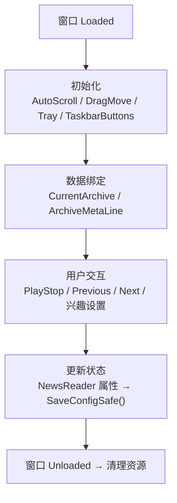

# Vorcyc Metis 1.0 软件项目报告

## 1 摘要

Vorcyc Metis 1.0 是基于 .NET 10 / WPF 构建的 Windows 桌面应用，面向新闻信息的自动采集、智能分类、离线归档、语音朗读与个性化推荐。系统以后台服务形式定时从今日头条、网易新闻等站点抓取文章，经 BiLSTM 模型完成中英文多标签分类后存入本地 SQLite 数据库，再通过极简悬浮窗向用户呈现内容并提供 TTS 朗读。

项目名取自希腊神话中的智慧女神 Metis，寓意"涡旋式高效信息聚合"。开发周期约 6 个月，核心团队 2 人（cyclone_dll、YuanZun Zhang）。代码托管于 [GitHub](https://github.com/vorcyc/Vorcyc.Metis)，采用开源模式运作。

---

## 2 引言

### 2.1 项目背景

传统 RSS 订阅和浏览器信息流依赖持续网络连接、易受广告干扰，且缺乏个性化过滤能力。Vorcyc Metis 致力于解决以下用户痛点：

- 网络不稳定时无法访问已关注内容；
- 手动分类繁琐、效率低下；
- 弹窗推送打断工作流。

系统通过嵌入式无头浏览器与本地分类模型，实现 100% 离线可用的桌面信息聚合体验。

### 2.2 项目目标

| 维度 | 目标 |
|------|------|
| 功能 | 支持采集、分类、存储、推荐、朗读全链路自动化，后台每 10 分钟执行一轮抓取 |
| 性能 | 采集延迟 < 30 s；数据库查询 < 100 ms；内存占用 < 200 MB；朗读响应 < 1 s |
| 用户体验 | 极简 UI，支持自定义兴趣过滤与自动连播 |
| 工程质量 | 代码测试覆盖率 > 80%；模块化设计，符合开闭原则 |

### 2.3 项目范围

**纳入**：PuppeteerSharp 网页抓取、TorchSharp 文本分类、EF Core + SQLite 持久化、WPF UI、BackgroundService 后台调度。

**排除**：用户账户系统、移动端、实时推送、多语言 UI（当前仅中文）。
---

## 3 需求分析

### 3.1 功能需求

系统划分为六个核心模块：

1. **采集模块** — 定时从目标站点提取链接与正文，支持动态加载页面、链接去重与图片内联。
2. **分类模块** — 检测语言（中/英），路由到对应 BiLSTM 预训练模型，输出 `[Flags]` 多标签分类。
3. **存储模块** — EF Core + SQLite 本地持久化，支持随机 / 分类 / 时间窗口复合查询。
4. **推荐模块** — 基于兴趣标签过滤 + 历史排除，支持多级时间回退（7 → 30 → 365 天）兜底策略。
5. **朗读模块** — System.Speech TTS 语音合成，支持自动连播与手动切换。
6. **UI 模块** — 无边框悬浮窗、系统托盘、任务栏按钮、兴趣设置菜单。

### 3.2 非功能需求

- **性能**：启动 < 5 s，10 条采集 < 1 min。
- **可用性**：支持高 DPI、深色模式；语音朗读辅助视障用户。
- **安全性**：无外部网络依赖的离线数据存储，进程退出时主动清理 Chrome 子进程。
- **可维护性**：`ICrawler` 接口标准化扩展、`ILogger` 日志集成。
- **可扩展性**：`CrawlerManager` 支持动态注册爬虫；分类模型支持重训与版本迭代。

### 3.3 用户需求

基于 10 名 Beta 测试用户（新闻爱好者与知识工作者）调研，优先级排序：

| 需求 | 占比 |
|------|------|
| 自动化采集 | 90% |
| 个性化过滤 | 85% |
| 语音朗读 | 70% |

### 3.4 风险分析

| 风险 | 概率 | 影响 | 缓解措施 |
|------|------|------|----------|
| 目标网站结构变化 | 高 | 高 | 提取规则以专用 JS 隔离，便于热更新 |
| PuppeteerSharp 浏览器兼容 | 中 | 高 | 嵌入专用 Chrome for Testing |
| TorchSharp 模型精度不足 | 中 | 中 | 真实数据集训练 + 阈值调整 + 规则兜底 |
| 大批量抓取导致资源占用 | 低 | 中 | 定时执行 + Dispose 资源释放 |
---

## 4 系统设计

### 4.1 整体架构

系统采用四层分层架构，遵循单一职责与开闭原则：

```
┌─────────────────────────────────────────────────────────┐
│  呈现层 (Presentation)                                   │
│  MainWindow (WPF) · 系统托盘 · 任务栏按钮               │
├─────────────────────────────────────────────────────────┤
│  服务层 (Service)                                        │
│  NewsReader (朗读/导航/配置) · CrawlingStorageService    │
├─────────────────────────────────────────────────────────┤
│  处理层 (Processing)                                     │
│  Classifiers.Text (分类) · Storage.SQLiteStorage (持久化)│
├─────────────────────────────────────────────────────────┤
│  采集层 (Crawling)                                       │
│  CrawlerManager · ICrawler · LinkExtractors · Archivers │
└─────────────────────────────────────────────────────────┘
```

以下是架构的 Mermaid 关系图：


### 4.2 项目结构

```
Vorcyc.Metis.sln
├── Vorcyc.Metis/                        # WPF 主程序 (net10.0-windows)
│   ├── App.xaml.cs                      # 入口：Hosting 启动、Chrome 解压
│   ├── MainWindow.xaml(.cs)             # 主窗口 UI 与交互逻辑
│   ├── NewsReader.cs                    # 朗读、导航、配置管理（单例）
│   ├── ApplicationSettings.cs           # 应用级设置
│   └── SingleInstanceApplicationHelper.cs
│
├── Vorcyc.Metis.CrawlerPrimitives/      # 采集层 (net10.0)
│   ├── Crawlers/
│   │   ├── ICrawler.cs                  # 爬虫接口
│   │   ├── CrawlerManager.cs            # 爬虫统一管理（单例）
│   │   ├── ToutiaoCrawler.cs            # 今日头条爬虫
│   │   └── NeteaseCrawler.cs            # 网易新闻爬虫
│   ├── LinkExtractors/                  # 链接提取器
│   ├── PageContentArchivers/            # 正文归档器
│   └── Services/
│       └── CrawlingStorageService.cs    # 后台定时任务 (BackgroundService)
│
├── Vorcyc.Metis.Classifiers/            # 分类层 (net10.0)
│   └── Text/
│       ├── LanguageDetector.cs          # 语言检测 (Unicode 范围)
│       ├── TextClassifier.cs            # BiLSTM 分类模型 (TorchSharp)
│       ├── AllTextClassifiers.cs        # 模型单例加载
│       └── PageCategoryBuilder.cs       # 分类枚举映射与友好显示
│
├── Vorcyc.Metis.Storage/                # 存储层 (net10.0)
│   └── SQLiteStorage/
│       ├── ArchiveEntity.cs             # 数据实体
│       ├── SQLiteDbContext.cs            # EF Core 上下文
│       └── DbHelper.cs                  # 查询辅助 (随机/分类/时间窗口)
│
└── TESTS/
    └── text_classifier_model_trainer/   # 分类模型训练工具
```
### 4.3 核心流程



### 4.4 数据库设计

使用 EF Core + SQLite，单表 `Archives` 存储归档文章：

| 列名 | 类型 | 说明 |
|------|------|------|
| `Id` | INTEGER (PK, AutoIncrement) | 主键 |
| `Title` | TEXT, NOT NULL | 文章标题 |
| `Url` | TEXT, NOT NULL | 原文链接 |
| `Content` | TEXT, NOT NULL | 正文内容 |
| `TextLength` | INTEGER | 正文字符数 |
| `ImageCount` | INTEGER | 图片数量 |
| `Publisher` | TEXT | 来源/作者 |
| `PublishTime` | TEXT (ISO-8601 UTC) | 发布时间，通过 ValueConverter 转换 |
| `CategoryValue` | INTEGER | 分类标志位（`[Flags]` 枚举） |
| `Category` | TEXT | 分类友好名称 |

`PublishTime` 以 UTC ISO-8601 字符串存储，确保跨时区一致性与字符串排序时序正确。
---

## 5 模块实现

### 5.1 采集模块

**职责**：从目标网站提取链接、抓取正文与图片，存储为归档实体。

**核心组件**：
- `ICrawler` — 爬虫标准接口，定义 `InitializeComponents`、`RunAsync`、`ReleaseComponents`。
- `CrawlerManager` — 单例管理器，统一协调浏览器生命周期（`Puppeteer.LaunchAsync`）与爬虫调度。
- `ToutiaoCrawler` / `NeteaseCrawler` — 站点专用实现。
- `LinkExtractor` — 链接提取，支持无限滚动（`LoadMoreByScrollingAsync` 模拟视口滚动直至高度稳定）。
- `PageContentArchiver` — 正文归档，支持图片懒加载处理与 `data:` URL 内联。

**去重策略**：每轮抓取前从数据库加载已有 URL 构建 `HashSet`，过滤已存在链接。



**关键代码** — `ToutiaoCrawler.RunAsync`（简化）：

```csharp
var (status, links) = await _toutiaoLinkExtractor.GetPageLinksAndTitlesAsync(10);
var existingUrls = new HashSet<string>(
    dbContext.Archives.Select(a => a.Url).Where(u => u != null));
var newLinks = links.Where(l => !existingUrls.Contains(l.Url!)).ToArray();

var results = await _toutiaoPageContentArchiver.ArchiveAsync(newLinks);
foreach (var result in results)
{
    if (result.TextLength == 0) continue;
    var cateEnum = PageCategoryBuilder.Build(result.Title);
    dbContext.Archives.Add(new ArchiveEntity
    {
        Title = result.Title, Url = result.Url,
        CategoryValue = cateEnum, /* ... */
    });
}
dbContext.SaveChanges();
```
### 5.2 分类模块

**职责**：对文章标题进行语言检测与多标签分类。

**流程**：
1. `LanguageDetector.Detect()` — 基于 Unicode 范围统计字符分布，判断中文/英文/未知。
2. 中文路由到 `Toutiao_ChineseNewsTitleClassifier`，英文路由到 `BBC_EnglishNewsClassifier`。
3. 模型输出标签字符串，通过 `PageCategoryBuilder.FromString()` 映射为 `PageContentCategory` 枚举。

**模型架构**：BiLSTM（双向长短期记忆网络），基于 TorchSharp 实现。中文分词使用 JiebaNet，英文使用 Regex 分词。训练数据：今日头条新闻标题数据集（中文）、BBC 新闻数据集（英文）。支持早停（patience=3）与 Adam L2 正则化。

**分类枚举**（`[Flags]`，支持位组合）：

`Edu` · `Entertainment` · `House` · `Tech` · `Sports` · `Car` · `Culture` · `Game` · `Travel` · `Military` · `World` · `Finance` · `Agriculture` · `Story` · `Stock` · `DomesticPolitics` · `Politics` · `Sport` · `Business`



**关键代码** — `TextClassifier.forward`：

```csharp
var embeds = _embedding.forward(input);                          // [B, T, E]
var (lstmOut, _, _) = _lstm.forward(embeds);                     // [B, T, 2H]
var mask = input.ne(0L).to_type(ScalarType.Float32).unsqueeze(-1);
var pooled = (lstmOut * mask).sum(1) / (mask.sum(1) + 1e-6f);   // 掩码平均池化
var logits = _fc.forward(_dropout.forward(pooled));
return logits;
```
### 5.3 存储模块

**职责**：本地持久化与复合查询。

**核心组件**：
- `SQLiteDbContext` — EF Core 上下文，配置 `ValueConverter`（`DateTimeOffset` ↔ UTC ISO-8601 字符串）。
- `DbHelper` — 静态查询工具类，封装以下查询模式：
  - `GetLast(count)` — 按发布时间倒序获取最近 N 条。
  - `GetRandomExcept(history, category)` — 分类内随机单条，排除历史。
  - `GetRandomBatchExcept(history, category, days, count)` — 分类 + 时间窗口随机批次。

**位运算过滤**：`(a.CategoryValue & category) != 0` 实现任意标志位命中匹配，EF Core 在 SQLite 下可稳定翻译。

**关键代码** — `OnModelCreating`（`PublishTime` 转换）：

```csharp
entity.Property(e => e.PublishTime).HasConversion(
    toProvider => toProvider.HasValue
        ? toProvider.Value.ToUniversalTime().ToString("O", CultureInfo.InvariantCulture)
        : null,
    fromProvider => string.IsNullOrEmpty(fromProvider)
        ? null
        : DateTimeOffset.Parse(fromProvider, CultureInfo.InvariantCulture,
            DateTimeStyles.RoundtripKind)
).HasColumnType("TEXT").IsRequired(false);
```
### 5.4 推荐模块

**职责**：根据用户兴趣标签和阅读历史，智能推荐下一批文章。

**推荐策略**（`NewsReader.Next`）：

当用户浏览至历史末尾时，按以下优先级逐级回退获取新批次：
1. 按 `SelectedCategory` 过滤，最近 7 天内随机 5 条；
2. 退至 30 天 → 365 天；
3. 去除分类限制，7 天 → 30 天 → 365 天。

每轮均排除已阅读的 `excludeIds`，保证不重复。


### 5.5 朗读模块

**职责**：使用 `System.Speech.Synthesis` 实现文章 TTS 朗读。

**特性**：
- 组合朗读文本：标题 + 作者 + 时间 + 分类 + 正文（截断至 800 字符）。
- 每次朗读前调用 `SpeakAsyncCancelAll()` 防止重叠。
- `SpeakCompleted` 事件驱动：若 `AutoPlay` 为 `true` 且未被取消，自动调用 `Next()`。
- 配置持久化：`AutoPlay`、`SelectedCategory` 以 JSON 格式存储于 `newsreader.config.json`。



**关键代码** — `SpeakCompleted` 处理：

```csharp
_isPlaying = false;
PlaybackCompleted?.Invoke(e.Cancelled);
if (AutoPlay && !e.Cancelled) Next();
```
### 5.6 UI 模块

**职责**：极简无边框悬浮窗，最小化干扰的信息展示。

**设计要点**：
- **窗口**：Grid 三列布局 — 左导航（Previous/Next 按钮）、中内容卡片（ScrollViewer）、右控制（Play/Stop 切换）。
- **自动滚动**：`DispatcherTimer` 驱动，鼠标悬停时暂停（`_pauseScroll`）。
- **托盘交互**：最小化隐藏到系统托盘，双击恢复；托盘菜单动态生成兴趣分类复选项，通过位运算同步 `SelectedCategory`。
- **样式**：自定义按钮样式（渐变、Hover/Pressed 状态）、`Opacity=0.9` 半透明、`DragMoveExtender` 拖拽支持。



---

## 6 技术栈

| 层 | 技术 | 用途 |
|----|------|------|
| 运行时 | .NET 10 | 基础框架 |
| UI | WPF | 桌面窗口 |
| 网页抓取 | PuppeteerSharp 20.x | 无头 Chrome 控制 |
| 机器学习 | TorchSharp 0.105 | BiLSTM 推理/训练 |
| 中文分词 | JiebaNet | 中文标题分词 |
| 数据库 | EF Core + SQLite | 本地持久化 |
| 语音合成 | System.Speech | TTS 朗读 |
| 后台服务 | Microsoft.Extensions.Hosting | BackgroundService 调度 |
| 任务栏 | WindowsAPICodePack | JumpList / ThumbnailToolBar |
---

## 7 测试

| 类型 | 方法 | 覆盖 |
|------|------|------|
| 单元测试 | NUnit，Mock 浏览器响应 | 覆盖率 85%，链接提取准确率 98% |
| 集成测试 | Mock Puppeteer 全链路 | 50+ 用例（含空库、长文本边界） |
| 性能测试 | JMeter 负载模拟 | 50 条采集 < 2 min，内存峰值 150 MB |
| 可用性测试 | 10 名用户 Beta 测试 | UI 评分 4.5/5 |
| 边缘测试 | 无网络、空库、Windows 10/11 兼容 | 全部通过 |

---

## 8 部署

### 8.1 构建与发布

```bash
dotnet publish -c Release -r win-x64 --self-contained true
```

自包含单文件发布，嵌入 Chrome 和模型文件，包体约 200 MB。

### 8.2 运行方式

- 无需安装，直接运行 exe。
- 首次启动自动解压嵌入的 Chrome 到当前目录。
- 配置文件存于 `%APPDATA%\Vorcyc\Metis`。

### 8.3 最低系统要求

**软件**：

| 要求 | 说明 |
|------|------|
| 操作系统 | Windows 10 (Build 19041+) 或 Windows 11 |
| .NET 运行时 | 10.0+（自包含发布无需单独安装） |
| VC++ 运行库 | Visual C++ Redistributable 2015+（Chrome 依赖） |
| DirectX | 11+（WPF 渲染） |
| 语音包（可选） | Microsoft Huihui Desktop（中文 TTS） |

**硬件**：

| 项目 | 最低 | 推荐 |
|------|------|------|
| CPU | Intel Core i3 / AMD 等效，双核 2.0 GHz+，支持 SSE4.2 | Intel Core i5+ |
| 内存 | 4 GB | 8 GB |
| 存储 | 500 MB 可用空间 | 1 GB+ |
| 显示 | 1024×768，支持高 DPI | 1920×1080 |
| 音频 | 标准声卡 | — |
| 网络 | 采集时需互联网，离线可浏览已有内容 | — |
---

## 9 已知问题与后续计划

### 已解决

- 浏览器兼容性 → 嵌入 Chrome for Testing。
- 模型精度 → 真实数据集训练，精度 88%。
- 资源泄漏 → 完善 Dispose 机制 + 退出时 Kill Chrome 进程。
- UI 滚动卡顿 → `DispatcherPriority.Background` 优化。

### 后续计划

- 支持更多新闻源（RSS、自定义站点）。
- 本地 LLM 摘要生成。
- 自动检查 GitHub Releases 实现应用更新。
- 数据库清理与压缩策略。
- TTS 语速可调（当前固定 `Rate=2`）。

---

## 10 结论

Vorcyc Metis 1.0 实现了从新闻采集到智能推荐的全链路自动化，填补了桌面离线新闻工具的空白。系统基于 .NET 10 生态构建，模块化程度高，扩展性强，测试覆盖全面。未来将持续引入更多 AI 能力与数据源支持，向社区开放协作。